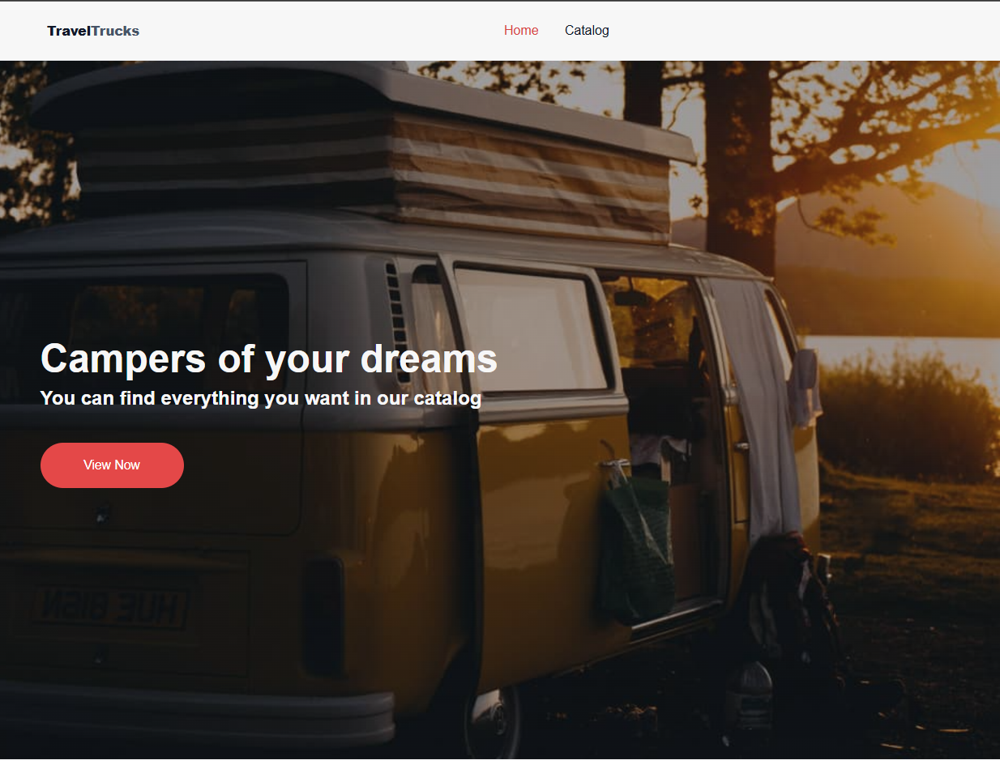
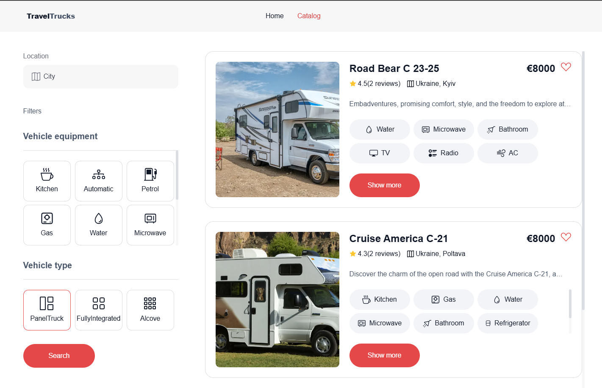
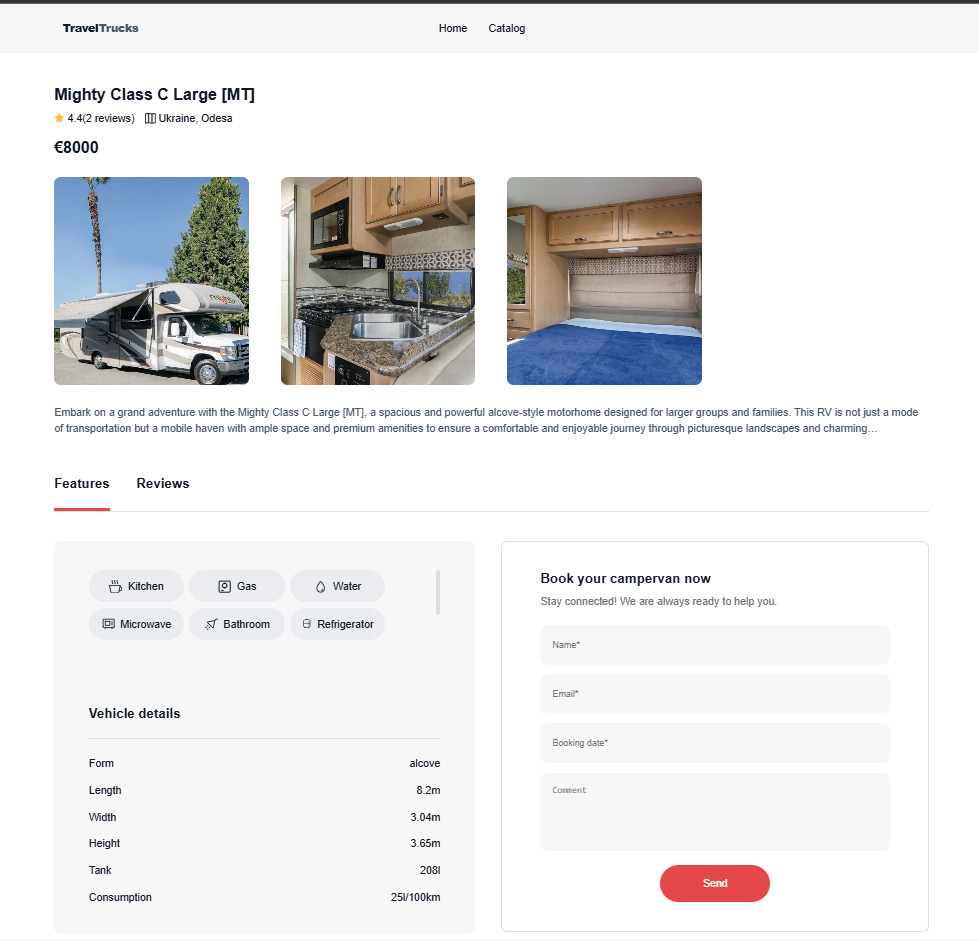

# TravelTrucks

**TravelTrucks** is a project showcasing the functionality of a camper rental
website. The web application includes several pages, such as a homepage, a
catalog page, and a single camper page with reviews and a booking form. The
application is built with responsive design, ensuring a smooth user experience
both on desktop and mobile devices.

## 🎯 Project Goals

- Develop the frontend of a web application for the "TravelTrucks" company,
  which specializes in camper rentals.
- Practice web development.
- Learn to work with frontend and backend technologies.

To implement the functionality for handling camper listings in our frontend
application, a prebuilt backend API is used, available at:  
[https://66b1f8e71ca8ad33d4f5f63e.mockapi.io/campers](https://66b1f8e71ca8ad33d4f5f63e.mockapi.io/campers)

## 🌐 Visit the Website

You can view the project live at:  
[TravelTrucks - Camper Rental Website](https://travel-trucks-ten-chi.vercel.app/)

## 📷 Screenshots

  
  

## 🛠 Tools and Technologies

### 📦 Core Dependencies

- **[@reduxjs/toolkit](https://redux-toolkit.js.org/)** — Library for state
  management in React.
- **[axios](https://axios-http.com/)** — Library for making HTTP requests.
- **[nanoid](https://github.com/ai/nanoid)** — Library for generating unique
  IDs.
- **[react-datepicker](https://reactdatepicker.com/)** — Component for date
  selection.
- **[react-hot-toast](https://react-hot-toast.com/)** — Library for creating
  notifications.
- **[react-loader-spinner](https://mhnpd.github.io/react-loader-spinner/)** —
  Components for loading indicators.
- **[react-redux](https://react-redux.js.org/)** — Library for integrating Redux
  with React.
- **[react-router-dom](https://reactrouter.com/)** — Library for routing in
  React.

### 🛠 Development Tools

- **HTML, CSS, JavaScript** — For creating the user interface.
- **[React](https://reactjs.org/)** — For building interactive components.
- **[Node.js](https://nodejs.org/) and [Express](https://expressjs.com/)** — For
  the backend.
- **[MongoDB](https://www.mongodb.com/)** — For the database.
- **[Vite](https://vitejs.dev/)** — Tool for fast project builds.
- **[Figma](https://www.figma.com/)** — Tool for interface design and
  prototyping.

## 👩‍💻 Authors

- **Inna Kushnir** — Developer [GitHub](https://github.com/INNA-KUSHNIRR1).
- **GoIT** — Mentor [site](https://www.edu.goit.global)

📧 Email: 3715777000i@gmale.com

# TravelTrucks

**TravelTrucks** — це проєкт, який демонструє функціонал сайту для оренди
кемперів. Веб-додаток включає кілька сторінок, серед яких домашня сторінка,
сторінка каталогу і сторінка окремого кемпера з відгуками і формою для
бронювання. Застосунок побудований з урахуванням адаптивного дизайну, що
забезпечує зручний користувацький досвід як на десктопних, так і на мобільних
пристроях.

## 🎯 Мета проєкту

- створити фронтенд частину веб-додатку для компанії "TravelTrucks", яка
  займається орендою кемперів.
- Практика у веб-розробці.
- Навчання роботі з фронтенд- та бекенд-технологіями.

Для реалізації функціоналу роботи з оголошеннями про кемпери у нашому
фронтенд-додатку, використовується готовий бекенд API, який доступний за
посиланням: https://66b1f8e71ca8ad33d4f5f63e.mockapi.io/campers

## 🌐 Відвідайте сайт

Ви можете переглянути проєкт у дії за посиланням::  
[TravelTrucks - Сайт для оренди кемперів](https://travel-trucks-ten-chi.vercel.app/)

## 📷 Скріншот

## 🛠 Інструменти та технології

📦 Основні залежності

- **@reduxjs/toolkit** — бібліотека для управління станом у React.
- **axios** — бібліотека для виконання HTTP-запитів.
- **nanoid** — бібліотека для генерації унікальних ідентифікаторів.
- **react-datepicker** — компонент для вибору дат.
- **react-hot-toast** — бібліотека для сповіщень.
- **react-loader-spinner** — компоненти завантажувачів.
- **react-redux** — бібліотека для інтеграції Redux.
- **react-router-dom** — бібліотека для маршрутизації у React.

🛠 Інструменти для розробки

- **HTML, CSS, JavaScript** — для розробки інтерфейсу користувача.
- **React** — для створення інтерактивних компонентів.
- **Node.js и Express** — для серверної частини.
- **MongoDB** — для базы даних.
- **Vite** - інструмент для швидкої збірки додатків.
- **Figma** - інструмент для дизайну інтерфейсів та прототипування

## 👩‍💻 Автори

- **Інна Кушнір** — розробка [GitHub](https://github.com/INNA-KUSHNIRR1).
- **GoIT** — наставник [site](https://www.edu.goit.global)

📧 Email: 3715777000i@gmale.com
